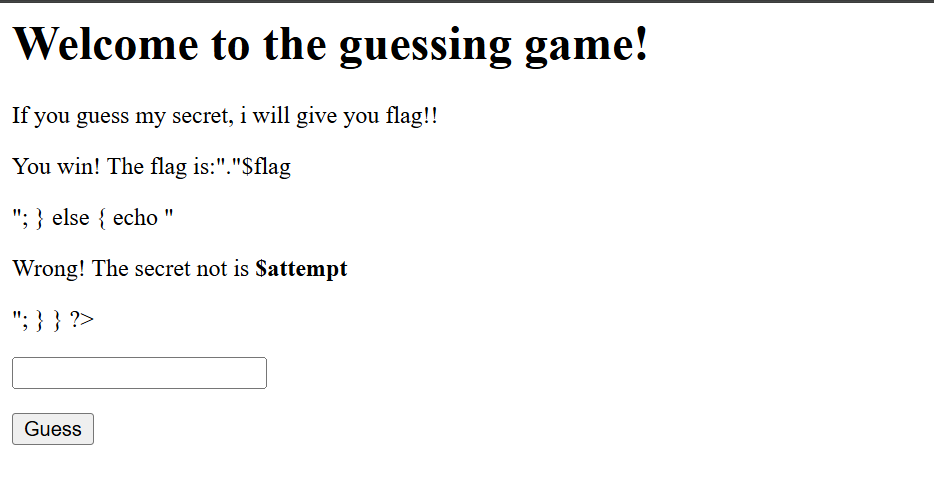

# Challenge: Enough PHP magic
200 PTS
# Description
If you guess my secret, i will give you flag!!
# Solution
This challenge welcomed me with a message asking me to guess a secret in order to obtain the flag. At first glance, I noticed that the application appeared to be written in PHP, and I identified several potential vulnerabilities. Initially, I suspected a PHP type juggling issue caused by loose comparisons.

I spent a while testing common payloads to exploit PHP type juggling problem but no luck.

I decided to change my approach, since the website was running PHP, therefore, I attempted to access `/index.phps` to check whether the source code was exposed.



The UI was somewhat confusing, let analyze more in the source code:

```php
<?php
            $filename = 'xxxxxxxx.txt';
            extract($_GET);
            if (isset($attempt)) {
                $combination = trim(file_get_contents($filename));
                if ($attempt === $combination) {
                    $flag = file_get_contents('xxxxxxxx.txt');
                    echo "<p>You win! The flag is:"."$flag</p>";
                } else {
                    echo "<p>Wrong! The secret not is <strong>$attempt</strong></p>";
                }
            }
        ?>
```

Function **extract($_GET)** here was a major problem because it generated variables from GET parameters and overwrited existing local variables. Meaning I can control to override predifined local variables via GET parameters.

The logic to obtain the flag was straightforward: the value of **$attempt** must exactly match the content of the file referenced by **$filename**. As mentioned above, I can manipulate GET parameters to also tamper with the value of **$filename**.

I simply created a payload to bypass this vulnerability by setting both **$filename** and **$attempt** to empty values, this caused the strict comparison to succeed and revealed the flag:

```
https://<your_server>/?filename=&&attempt=
```

