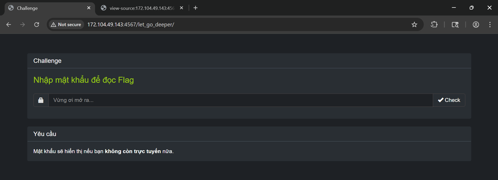

# Challenge: Tricky Sneaky Weby
100 PTS
# Description
Let' break all the level, and steal the flag!
# Solution
I started the challenge at route _/level1_ which required me enter a password to get the flag. Fortunately, there was a line that showing the hint of password.


It was mentioning the password is **SUN$HELL**, hence I followed this hint. But no luck, my input was automatically converted to lowercase. I went to the source of this web 
to understand what was happening. 

```js
jQuery(document).ready(function ($) {
        $('#password').on('keydown keyup', function () {
          $(this).val($(this).val().toLowerCase());
```

Ah, then I understood, seems I was not able to enter the input directly in website. Not a big problem, I prepared a customised request which I ensured the password was uppercase.

```
POST /level1/ HTTP/1.1
Host: 172.104.xx.xxxx:xxxx
....
password=SUN%24HELL&submit=
```

Alright, I passed the first layer successfully, then clicked on what it required to redirect to next route _/let_go_deeper_. But this time, the hint is unclear, I didn't know what it was trying to show. 



Let dig into the source of it to find something more interesting.

```html
....
<div class="hidden" id="togglePassword">
        <br>
        <div class="alert alert-info">
                Chúc mừng! Đây là mật khẩu bạn cần: <code>YmVfcHJvZmVzc2lvbmFs</code>
        </div>
</div>
....
    <script>
    jQuery(document).ready(function($) {
      let $el = $('#togglePassword'),
      $code = $el.find('code'),
      orig = $code.text();
      function toggle() {
        if (navigator.onLine) {
          $el.addClass('hidden');
          $code.text(orig);
        } else {
          $el.removeClass('hidden');
          $code.text(atob(orig));
        }
      }
....
```

I didn't know why the script detected me as offline, but I knew that it was hiding and encoding the password as based64 format. Hence, just decoced the string **YmVfcHJvZmVzc2lvbmFs** and validate it in this route. I thought the flag it showed is correct but it was a trap, there was a line giving information to redirect to another route /is_this_the_end.

```html
....
<strong>Success!</strong> flag is <strong>Flag{death_is_like_the_wind}</strong> 
              <p style="color: #1e2125">Không không, đấy không phải flag đâu, chúc mừng bạn đã vượt qua lớp bảo mật tiếp theo. Chúng ta cùng tiếp tục chứ <a href="/is_this_the_end" style="color: #1e2125">Click Me!</a></p>
....
```

This route was preventing me to open the source via DevTools, therefore, I leveraged the content response.

```html
....
        Mật khẩu: <code style="user-select: none;" id="password">f92​9cb2​e​53​b​​1​1​b​d​c​223​e32547a9​da2​6​2​2​c​2​c​913​deed​f​2​5​75b​f9​5​2​39d</code>
<script>
      jQuery(document).ready(function(a){a("#form").submit(function(a){a.preventDefault();return!1})});
</script>
....
```

It was even preventing me submit the password via the form in this route. The title **I trust what I see** encouraged me use the hex string to validate. But the hex string contained invisible characters, so I removed these to sanitize it.

Finally, I customised a request storing my payload.

```
POST /is_this_the_end/ HTTP/1.1
Host: 172.104.xx.xxx:xxxx
....
password=f929cb2e53b11bdc223e32547a9da2622c2c913deedf2575bf95239d&submit=
```

Yeah, I found the flag in the response.
