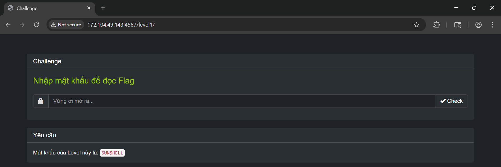

# Challenge: Tricky Sneaky Weby
100 PTS
# Description
Let' break all the level, and steal the flag!
# Solution
I started the challenge at route _/level1_ where required me enter a password to get the flag. Fortunately, there was a line that showing the hint of password.



It was mentioning the password is **SUN$HELL**, hence I followed this hint. But no luck, my input was automatically converted to lowercase. I went to the source of this web 
to understand what was happening. 

```js
jQuery(document).ready(function ($) {
        $('#password').on('keydown keyup', function () {
          $(this).val($(this).val().toLowerCase());
```

Ah, then I understood, seems I were not able to enter the input directly in website. Not a big problem, I prepared a customised request which I ensured the password was uppercase.
