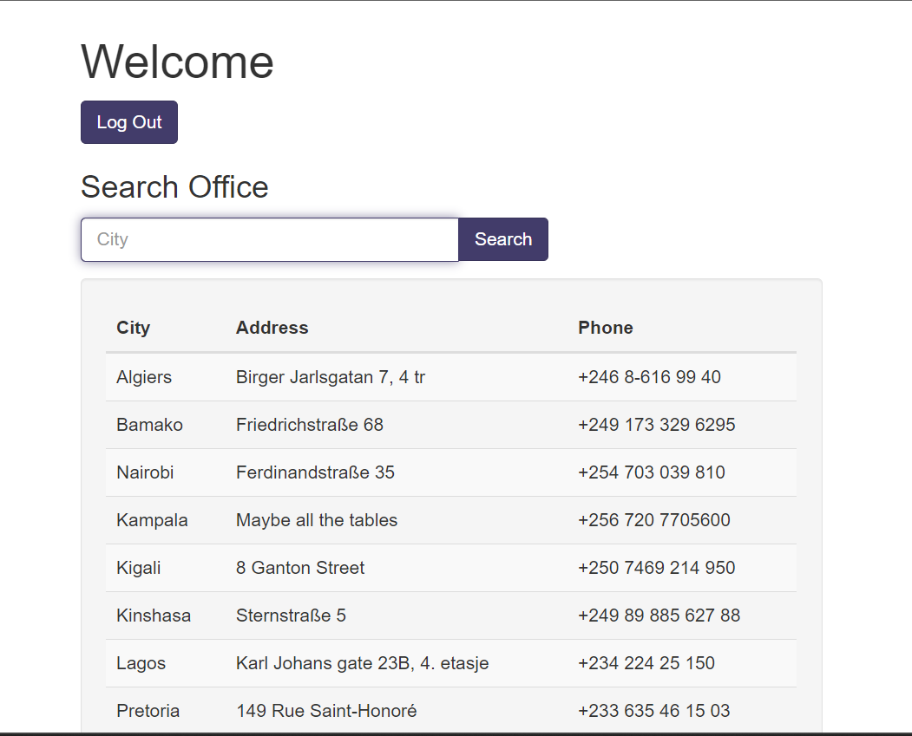
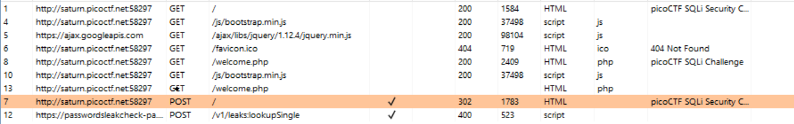

# Challenge: [More SQLi](https://play.picoctf.org/practice/challenge/358)
200 Points
# Description
Can you find the flag on this website.

Additional details will be available after launching your challenge instance.
# Solution
According to the hint and after a few attempts, I accessed to a list of users on this site. Here is my command in password textbox: `' or 1=1--`, you can enter whatever you want into username textbox.

I think I can do more to find to obtain the flag due to flag not here @_@ 

When it redirected, it take a while, I guess I may miss something. Do again by using Burp Suite, I find the flag in the packet below:

The flag is: picoCTF{************}