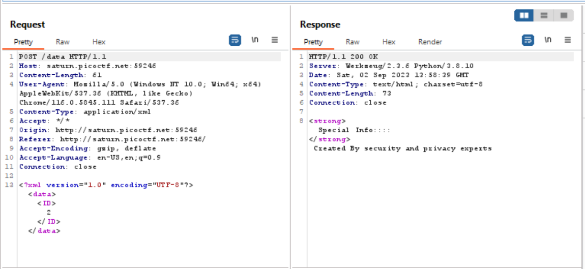
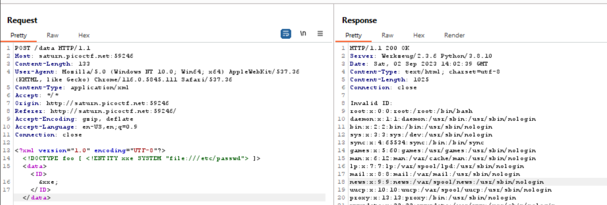

# Challenge: [SOAP](https://play.picoctf.org/practice/challenge/376)
100 Points
# Description
The web project was rushed and no security assessment was done. Can you read the /etc/passwd file?

Additional details will be available after launching your challenge instance.
# Solution
To address this challenge, I use Burp Suite. When I click buttons that describe futher information, my request brings me a chance to leverage XXE attack. 

I find a payload to server XXE attack and insert it to my request as below:

The flag is: picoCTF{************}