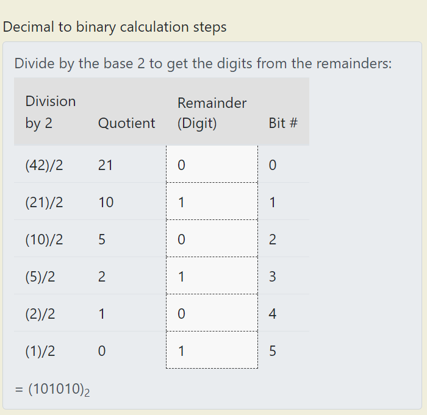

# Challenge: [2Warm](https://play.picoctf.org/practice/challenge/86)
50 Points
# Description
Can you convert the number 42 (base 10) to binary (base 2)?
# Solution
This is an easy task, I just want to remind how to convert them:

When having decimal value, easily find what character is compatible with it.

The flag is: picoCTF{**********}