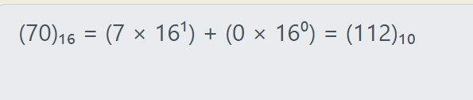

# Challenge: [Lets Warm Up](https://play.picoctf.org/practice/challenge/22)
50 Points
# Description
If I told you a word started with 0x70 in hexadecimal, what would it start with in ASCII?
# Solution
This is an easy task, I just want to remind how to convert them:

When having decimal value, easily find what character is compatible with it.

The flag is: picoCTF{**********}