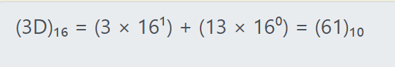

# Challenge: [Warmed Up](https://play.picoctf.org/practice/challenge/58)
50 Points
# Description
What is 0x3D (base 16) in decimal (base 10)?
# Solution
This is an easy task, I just want to remind how to convert them:

Get the decimal value, this's also the flag.

The flag is: picoCTF{**********}