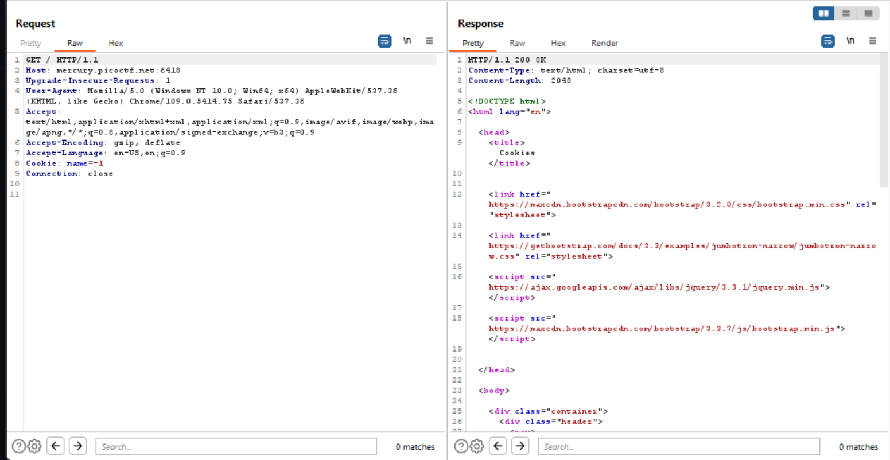

# Challenge: [Cookies](https://play.picoctf.org/practice/challenge/173)
40 Points
# Description 
Who doesn't love cookies? Try to figure out the best one.
# Solution
I use tool Burp Suite to view the response and cookie from my request. I know that the server has many cookies and I can modify them through param name.



I try modifying value of name with positive values and have some different cookies. Therefore, I write a script to find the flag, this script have a loop from 0 to 30 (I also test name=30 and it does not give me a good result).
```php
<?php

$url = "http://mercury.picoctf.net:6418/check";

$curl = curl_init($url);
curl_setopt($curl, CURLOPT_URL, $url);
curl_setopt($curl, CURLOPT_RETURNTRANSFER, true);

for($i=0; $i<=30; $i++){
	$headers = array("Cookie: name=$i",);
	curl_setopt($curl, CURLOPT_HTTPHEADER, $headers);

	$resp = curl_exec($curl);
	if(str_contains($resp, 'picoCTF{')){
		var_dump($resp);
	}
}


curl_close($curl);


?>


```
The flag is contained in the result when you excute it.
The flag is: picoCTF{***********}