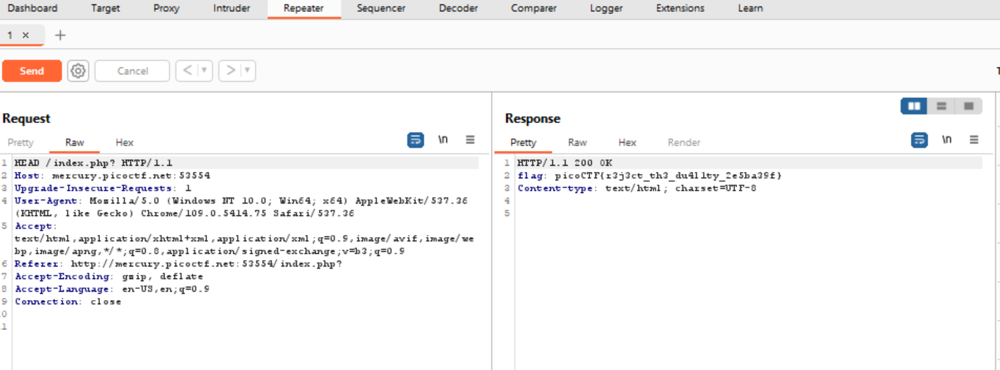

**Challenge**: [Get a HEAD](https://play.picoctf.org/practice/challenge/132)
----------
Following their hints, I take the url of server into Burp Suite to modify my request. But what I need to modify, I should view the response that the server send for me.
```html
HTTP/1.1 200 OK
Content-type: text/html; charset=UTF-8


<!doctype html>
<html>
<head>
    <title>Red</title>
    <link rel="stylesheet" type="text/css" href="//maxcdn.bootstrapcdn.com/bootstrap/3.3.5/css/bootstrap.min.css">
	<style>body {background-color: red;}</style>
</head>
	<body>
		<div class="container">
			<div class="row">
				<div class="col-md-6">
					<div class="panel panel-primary" style="margin-top:50px">
						<div class="panel-heading">
							<h3 class="panel-title" style="color:red">Red</h3>
						</div>
						<div class="panel-body">
							<form action="index.php" method="GET">
								<input type="submit" value="Choose Red"/>
							</form>
						</div>
					</div>
				</div>
				<div class="col-md-6">
					<div class="panel panel-primary" style="margin-top:50px">
						<div class="panel-heading">
							<h3 class="panel-title" style="color:blue">Blue</h3>
						</div>
						<div class="panel-body">
							<form action="index.php" method="POST">
								<input type="submit" value="Choose Blue"/>
							</form>
						</div>
					</div>
				</div>
			</div>
		</div>
	</body>
</html>
```
From the response, I find that I just have 2 options to choose *Red* or *Blue* but choosing an other color is not make sense as it has lots of colors. I realize it also use 2 mothods, I will try out HEAD method because of their title :))))
Send the request to _Repeater_ and change GET to HEAD. Get the flag in the respone.



The flag is: picoCTF{*********}
