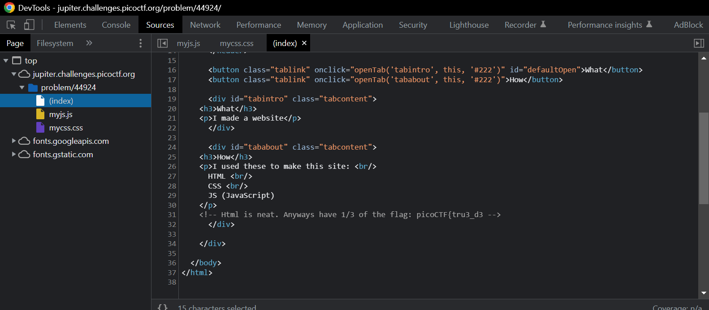

# Challenge: [Insp3ct0r](https://play.picoctf.org/practice/challenge/18)
50 Points
# Description
Kishor Balan tipped us off that the following code may need inspection: https://jupiter.challenges.picoctf.org/problem/44924/ (link) or http://jupiter.challenges.picoctf.org:44924
# Solution
Follow hints, I use DevTools in Chrome to check source code of web and find something interesting in html file.

Get 1/3 of the flag. The rest are in css and js file. Link them to a string and I have the flag.

The flag is: **********
