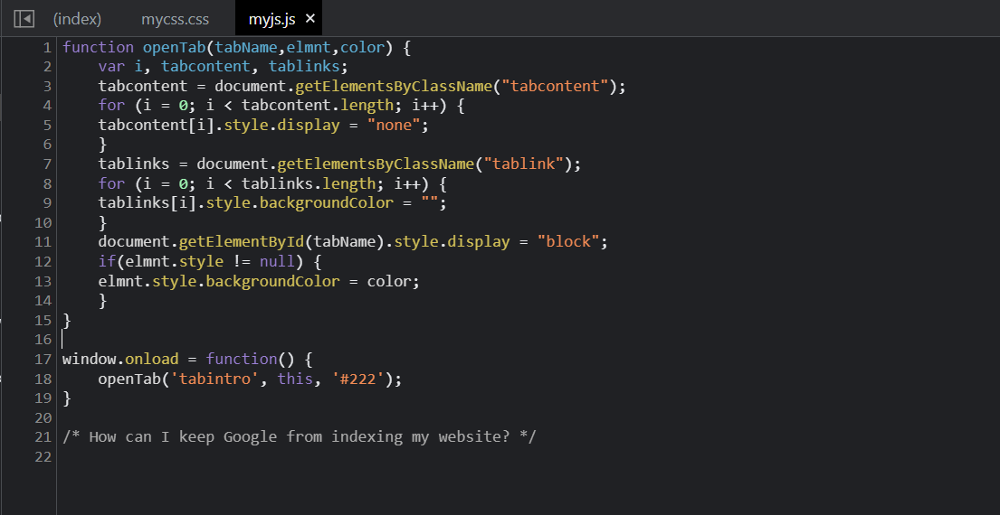
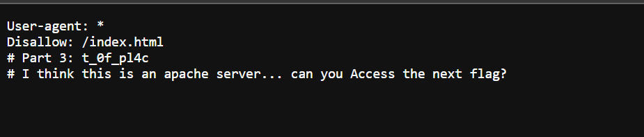
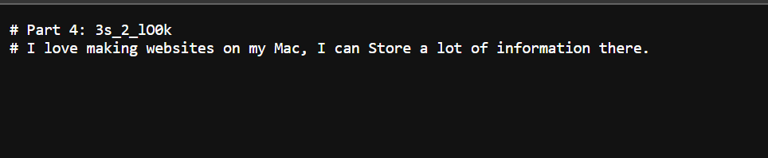
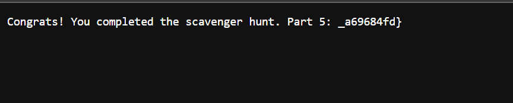

# Challenge: [Scavenger Hunt](https://play.picoctf.org/practice/challenge/161)
50 Points
# Description 
There is some interesting information hidden around this site http://mercury.picoctf.net:27278/. Can you find it?
# Solution
Stating sources of the site, I find 2 parts of the flag in file **index** and **.css**. In file **myjs.js**, it doesn't contains flag but it give me a hint as bellow:

I recongnise it refers to **robots.txt** preventing search engine crawlers running on URLs you don't want. I head to ./robots.txt and receive another part of the flag.

Moreover, I also have a clue for next part. The creator tells that this is an apache server. It might refer to **.htaccess** related to permisson. Let try it at the path /.htaccess

The fouth part of the flag is found and I receive a hint as well. I know that the creator making this website on Mac so I will check **.DS_Store**, it appears on Mac for storing custom attributes/metadata of its containing folder and the names of other files around it.

Access to it and get the last part.

The flag is: picoCTF{***************}