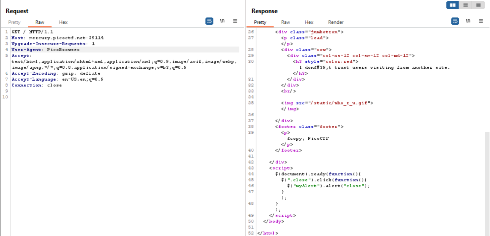
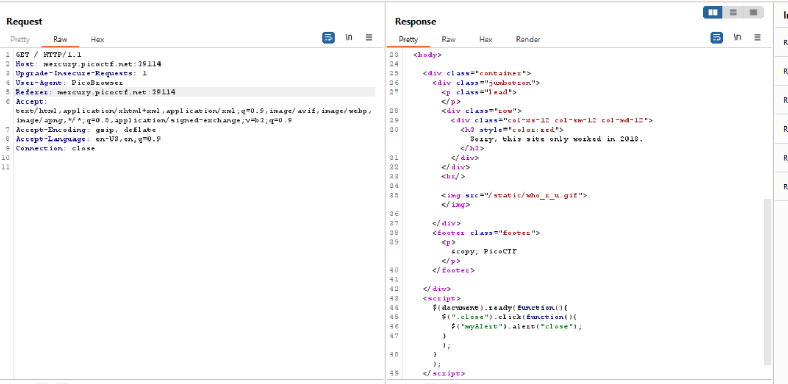
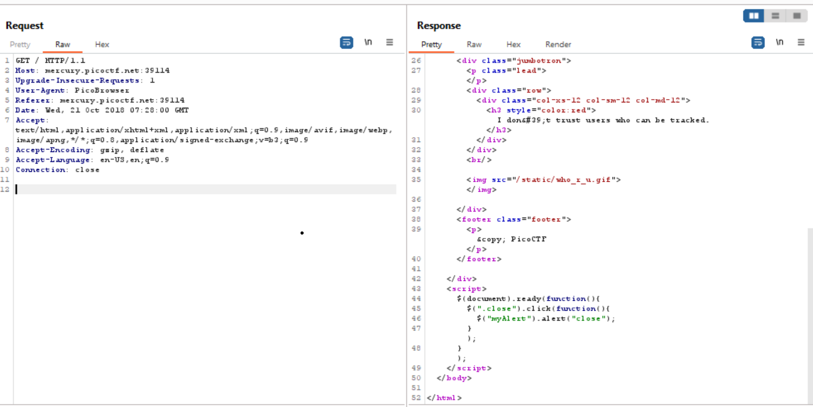
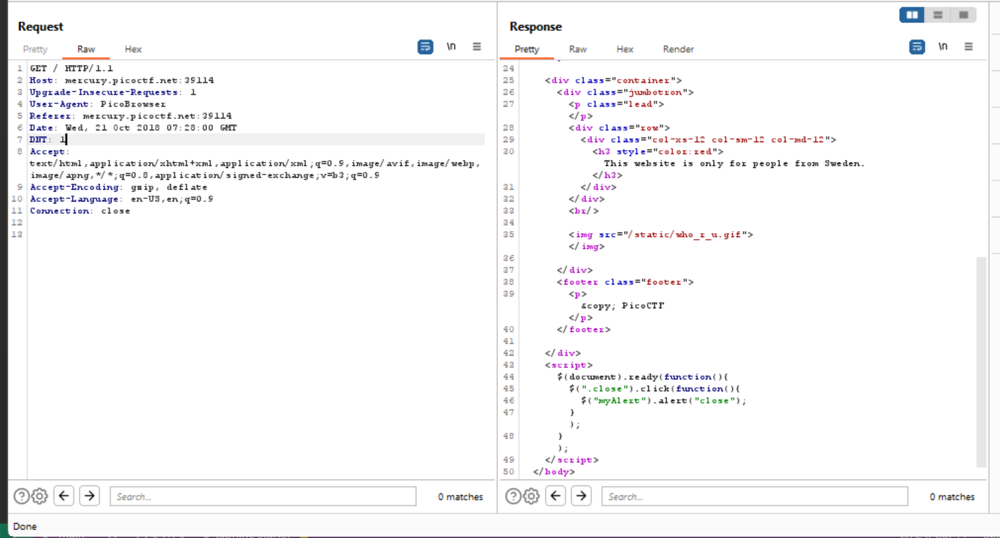
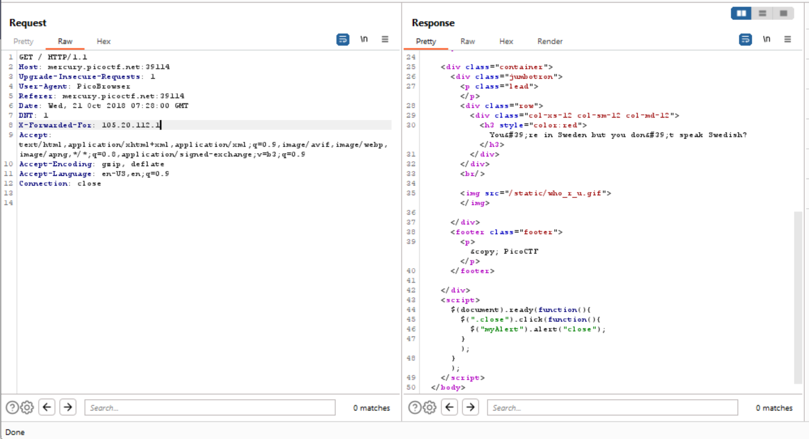
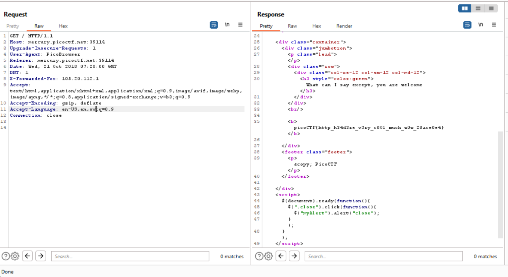

# Challenge: [Who are you](https://play.picoctf.org/practice/challenge/142)
100 Points
# Description
Let me in. Let me iiiiiiinnnnnnnnnnnnnnnnnnnn http://mercury.picoctf.net:39114/
# Solution
The aim of this challenge is that it wants me use some of head fields in http request to find the flag, the site always asks me *Who are you?* and gives the reasons. 

The first reason is *Only people who use the official PicoBrowser are allowed on this site*, just modify **User-Agent** field to pass it.

After pass the first reason, I see the second one as *I don't trust users visiting from another site*, it means that my referring page is not on mercury.picoctf.net:39114 or one can say I have no requested resources on this site.

Add **Referer: mercury.picoctf.net:39114** to the http request.

Reading the reason *Sorry, this site only worked in 2018*, I solve this by adding **Date** field, using year 2018. Example: Wed, 21 Oct 2018 07:28:00 GMT

Too careful, **I don't trust users who can be tracked**. To remove tracking, I use the field named **DNT** with value 1.

Next, I need to find an IP address in Sweden, assigning it to **X-Forwarded-For**

Ok, I need to speak Swedish to pass the last reason *You're in Sweden but you don't speak Swedish?*, add value sv to **Accept-Language**.

The flag is: picoCTF{***************}