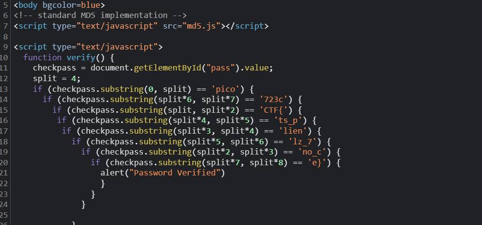

# Challenge: [dont-use-client-side](https://play.picoctf.org/practice/challenge/66)
100 Points
# Description 
Can you break into this super secure portal? https://jupiter.challenges.picoctf.org/problem/29835/ (link) or http://jupiter.challenges.picoctf.org:29835
# Solution
The challenge give an website verifying credential informations to proceed. I firstly check source code of this website whether it has something interesting.

Here is it, I see some *if* lines in it, just care about strings in each ones. Concatenating them oderly and I receive the flag.

The flag is: picoCTF{*********}