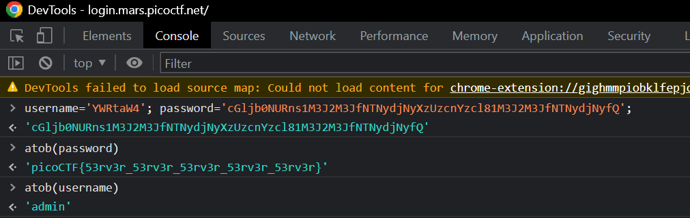

# Challenge: [login](https://play.picoctf.org/practice/challenge/200)
100 Points
# Description
My dog-sitter's brother made this website but I can't get in; can you help?
https://login.mars.picoctf.net/
# Solution
Based on the description, I need to log in this site to get the flag. First, reading the sources, I notice a script in [index.js](./index.js):

```js
(async()=>{
    await new Promise((e=>window.addEventListener("load",e))),
    document.querySelector("form").addEventListener("submit",(e=>{
        e.preventDefault();
        const r={
            u:"input[name=username]",p:"input[name=password]"
        }
            ,t={};
        for(const e in r)
            t[e]=btoa(document.querySelector(r[e]).value).replace(/=/g,"");
        return"YWRtaW4"!==t.u?alert("Incorrect Username"):"cGljb0NURns1M3J2M3JfNTNydjNyXzUzcnYzcl81M3J2M3JfNTNydjNyfQ"!==t.p?alert("Incorrect Password"):void alert(`Correct Password! Your flag is ${atob(t.p)}.`)
    }
    ))
}
)();
```

This script is used to verify accounts entered. Obviously, the true password is the flag I need to find. 

Due to the password decoded with Base64 and compared to a string 'cGljb0NURns1M3J2M3JfNTNydjNyXzUzcnYzcl81M3J2M3JfNTNydjNyfQ'.

I use the console in DevTools to decode the password.



The flag is: picoCTF{************}