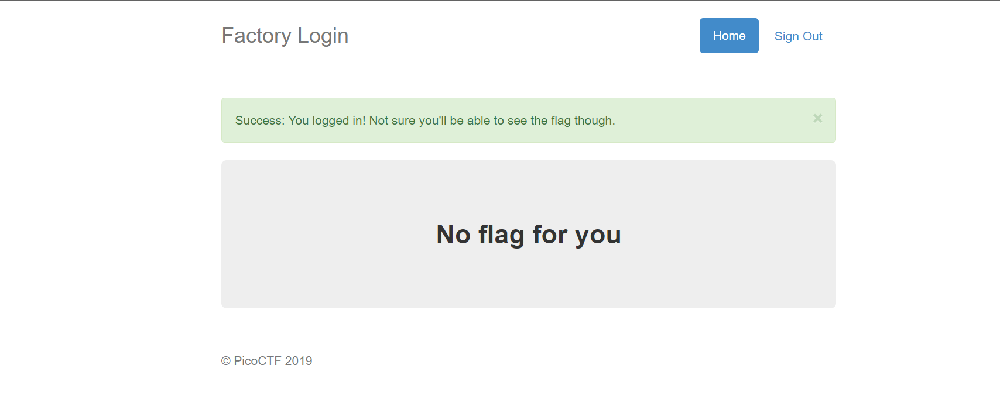
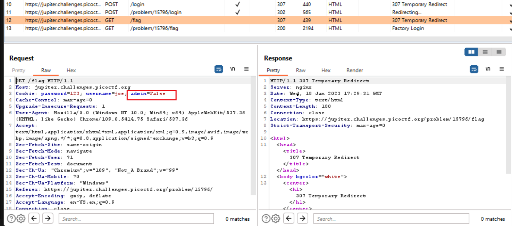

# Challenge: [logon](https://play.picoctf.org/practice/challenge/46)
100 Points
# Description
The factory is hiding things from all of its users. Can you login as Joe and find what they've been looking at? https://jupiter.challenges.picoctf.org/problem/15796/ (link) or http://jupiter.challenges.picoctf.org:15796
# Solution
I log in with an fake account and then it also accept but I can't have anything related to the flag.

May be Joe is a boss, just him can't see flag. Why don't I pose as him, using Burp Suite help me make it.

I find an critical information in cookie in my request.

I send my request to **Repeater** and modify the value of variable admin from Flase to True, send request again and get the flag.

The flag is: picoCTF{**************}
