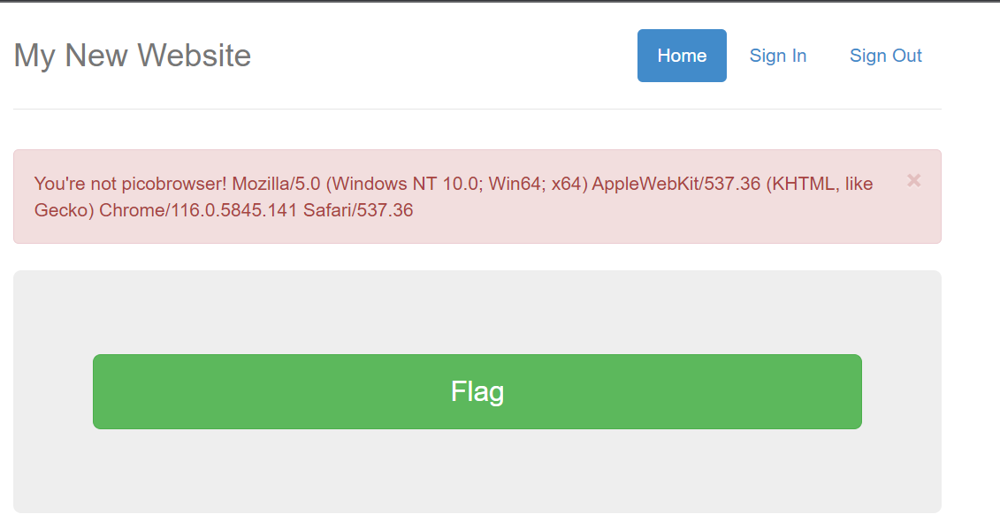
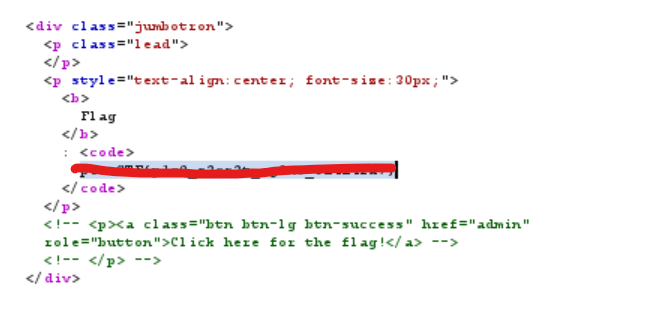

# Challenge: [picobrowser](https://play.picoctf.org/practice/challenge/9)
200 Points
# Description
This website can be rendered only by picobrowser, go and catch the flag! https://jupiter.challenges.picoctf.org/problem/50522/ or http://jupiter.challenges.picoctf.org:50522
# Solution
Start the challenge by accessing the link, I get an message that indicates my browser is not picobrowser. Thus, I get the detail of my browser.

Yahhh! The challenge notes me don't need to download another browser, I will change User-Agent field in the request header. Try the name **picobrowser** as the challenge name.

The flag is: picoCTF{***********}