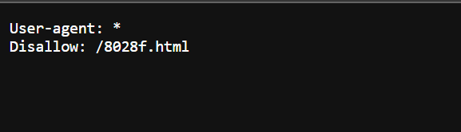

# Challenge: [where are the robots](https://play.picoctf.org/practice/challenge/4)
100 Points
# Description 
Can you find the robots? https://jupiter.challenges.picoctf.org/problem/60915/ (link) or http://jupiter.challenges.picoctf.org:60915
# Solution 
As the title mentions robots, it makes me think about robots.txt, a file tells search engine crawlers which URLs it can access on  website. 

I access to the link of robots.txt: https://jupiter.challenges.picoctf.org/problem/60915/robots.txt

Disallow meaning robots should not access to https://jupiter.challenges.picoctf.org/problem/60915/8028f.html, this path contains the flag. 

The flag is: picoCTF{***************}