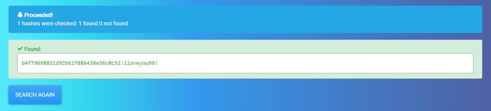

# Challenge: [Hash - NT](https://www.root-me.org/en/Challenges/Cryptanalysis/Hash-NT)
5 Points
# Description
Retrieve the password of the Administrator user from the information given by the secretsdump tool of the Impacket suite.
# Solution
Take a look at the given source of the challenge, I know where I can find NT hash
> [*] Dumping local SAM hashes (uid:rid:lmhash:nthash)
> Administrator:500:aad3b435b51404eeaad3b435b51404ee:b4f79698831d92b61f886438e36c0c52:::
Get the NT hash like bellow
```
b4f79698831d92b61f886438e36c0c52
```
I don't know why I can crack NT hash by John The Ripper as previous challenges. Luckily, I found an [website](https://hashes.com/en/decrypt/hash) help me do that.

The flag is: ***********